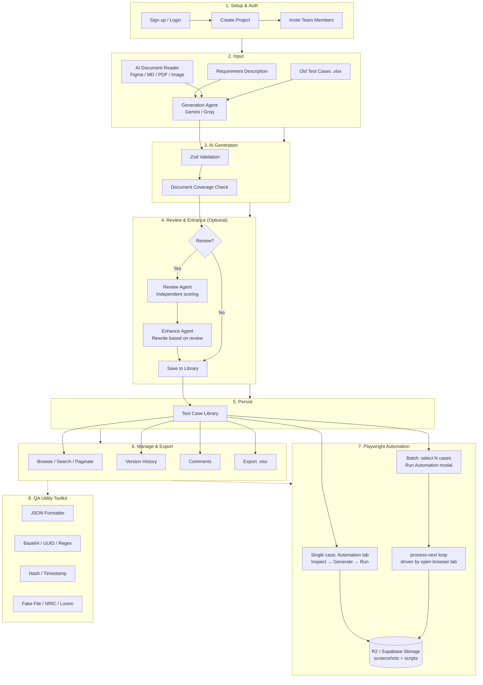

Built by **Jordan Le** (Le Van Anh Tan)
# QAJD — AI Test Case Generator & QA Toolkit

> Internal QA platform: AI test case generation with an independent Senior QA Review Agent, a project-based test case library with RAG-powered old-case retrieval and Requirement Traceability, an AI-grounded Playwright automation agent (single-case and batch), and a client-side QA Utility Toolkit.

[](https://nextjs.org/)
[](https://www.typescriptlang.org/)
[](https://tailwindcss.com/)
[](https://supabase.com/)
[](LICENSE)

---

## Table of Contents

- [System Overview](#system-overview)
- [Quick Start](#quick-start)
- [Features](#features)
- [Tech Stack](#tech-stack)
- [Project Structure](#project-structure)
- [Database Schema](#database-schema)
- [Core Flows](#core-flows)
- [Environment Variables](#environment-variables)
- [API Endpoints](#api-endpoints)
- [Core Principles](#core-principles)
- [Roadmap](#roadmap)
- [License](#license)

---
## System Overview



## Quick Start

```bash
# 1. Clone & install
git clone https://github.com/AnhTan1420/QA-AI-Tool.git
cd QA-AI-Tool
npm install

# 2. Configure environment
cp .env.example .env.local
# Fill in Supabase + AI provider keys (see Environment Variables); R2 is optional

# 3. Initialize database
# Supabase SQL Editor → run schema.sql (enables vector/pgcrypto, creates tables,
# RLS policies, the profiles-on-signup trigger, and the screenshots storage bucket)

# 4. Run
npm run dev
# http://localhost:3000 → Register → Create Project → Generate
```

**Prerequisites**: Node.js 20+, a Supabase project (free tier is fine), a Gemini API key (required) and Groq API key (recommended fallback). Cloudflare R2 is optional — see [CLOUDFLARE_R2_SETUP.md](CLOUDFLARE_R2_SETUP.md); without it, storage falls back to Supabase Storage automatically.

---

## Features

| Feature | Description |
|---------|-------------|
| AI Test Case Generation | Structured test cases from a natural-language requirement, via Copilot → Gemini → Groq fallback |
| Senior QA Review & Enhance | Independent agent scores coverage, flags gaps/comments, and can rewrite the set based on its own review |
| Test Case Library | Search, paginate, bulk-delete, version history, threaded comments |
| Old-Cases Import (Excel) | Upload an existing `.xlsx` suite to review or feed as generation reference |
| RAG Retrieval | Old test cases auto-embed on upload and are auto-retrieved by semantic similarity during generation |
| Requirement Traceability Matrix | Every AI-identified requirement clause matched against saved test cases, shown as a coverage matrix |
| AI Document Reader | Atomizes Figma designs, MD/PDF/DOCX docs, or ERD/diagram images into elements the Generation Agent must map into test cases |
| Playwright Automation Agent | Generates, runs, and versions real `@playwright/test` scripts grounded in a server-inspected DOM/element map — single-case or batch |
| Project Environments | Reusable, non-secret automation targets (browser + URL + auth mode) per project |
| Screenshot & Script Storage | Cloudflare R2 with automatic Supabase Storage fallback; signed URLs always re-derived fresh |
| QA Utility Toolkit | JSON formatter, Base64, UUID, Regex tester, Hash (SHA-1/256), Timestamp converter, Fake File generator, SG NRIC/FIN generator & validator, Lorem Ipsum |
| Team Management | Role-based project access (`qa` / `admin`) with email invitation |
| Bilingual UI | Vietnamese / English toggle |
| Auth | Supabase Auth — email/password + Google OAuth |

---

## Tech Stack

```
Frontend:     Next.js 16 + React 19 + TypeScript + Tailwind CSS 4
Backend:      Next.js API Routes + Server Components
Database:     Supabase PostgreSQL + pgvector
Auth:         Supabase Auth (Email/Password + Google OAuth)
AI/LLM:       GitHub Copilot (proxy) → Google Gemini (@google/genai) → Groq (groq-sdk), automatic fallback
Automation:   Playwright (playwright-core + @sparticuz/chromium on serverless, full `playwright` self-hosted)
Storage:      Cloudflare R2 (S3-compatible, @aws-sdk/client-s3), Supabase Storage as fallback
Validation:   Zod (all AI I/O and automation config)
Testing:      Vitest
Deployment:   Vercel (Hobby-tier compatible) / self-hosted
```

---

## Project Structure

> Full file-by-file breakdown: [PROJECT_STRUCTURE.md](PROJECT_STRUCTURE.md).

```
QA-AI-Tool/
├── app/
│   ├── (auth)/                        # Login & Register
│   ├── (dashboard)/
│   │   ├── dashboard/                 # Overview stats
│   │   ├── projects/[projectId]/
│   │   │   ├── generate/              # AI generation wizard
│   │   │   ├── test-cases/            # Library (list + detail, Automation tab, batch trigger)
│   │   │   ├── automation/environments/
│   │   │   └── team/
│   │   └── tools/                     # QA Utility Toolkit
│   └── api/
│       ├── ai/                        # generate, enhance, documents/parse, embed, playwright
│       ├── ai-reviews/
│       ├── projects/                  # CRUD + members + environments
│       ├── test-case-sets/
│       ├── automation/                # inspect, run, batch-run + process-next, screenshot
│       └── test-cases/                # CRUD + comments + versions + automation scripts/runs
├── components/                        # auth, automation, layout, team, test-case(-form/-list), tools
├── lib/
│   ├── ai/                            # providers (copilot/gemini/groq), prompts, parsing
│   ├── automation/                    # browser runner, batch runner, R2/Supabase storage, rate limiter
│   ├── documents/                     # AI Document Reader helpers
│   ├── validators/                    # Zod schemas
│   ├── i18n/  ├── utils/  ├── supabase/
│   └── test-case-taxonomy.ts
├── schema.sql                         # Full DB schema + RLS + triggers
├── proxy.ts                           # Session refresh + auth redirect
└── package.json
```

> **Convention**: non-trivial screens live as `components/<feature>/` with a `use-<feature>.ts` hook for state/API calls; `page.tsx` stays a thin orchestrator.

---

## Database Schema

```
auth.users (1:1) ──► profiles (1:N) ──► projects (1:N) ──► test_case_sets (1:N) ──► test_cases
                                            │                │                            │
                                            ▼                ▼                            ▼
                                    project_members   project_environments        test_case_versions
                                            │                │                            │
                                            ▼                ▼                            ▼
                                     requirements   automation_batch_runs        test_case_embeddings
                                                            │                            │
                                                            ▼                            ▼
                                                automation_batch_run_items   requirement_traceability

test_cases (1:N) ──► automation_scripts (versions)
test_cases (1:N) ──► automation_runs (pass/fail history, screenshot_url)
```

**Key decisions**:
- `test_cases` has **no `project_id`** — always join through `test_case_sets.project_id`.
- `profiles` auto-created via trigger on `auth.users` insert.
- RLS is the primary access-control layer; Zod validates at the API boundary.
- `test_case_embeddings` uses `pgvector` (`ivfflat` index) for semantic search.
- `project_environments` stores only name, browser, target URL, and auth **mode** — never secrets. Cookie tokens / login credentials are supplied fresh at run time, never persisted.
- `automation_batch_runs` / `automation_batch_run_items` track a resumable queue (`queued → running → passed/failed/error/skipped`), advanced one item per request.

---

## Core Flows

### AI Generation
1. Enter a requirement (optionally attach an old `.xlsx` suite and/or run the AI Document Reader on a Figma link, MD/PDF/DOCX doc, or ERD/diagram image).
2. `/api/ai/generate` calls Copilot → Gemini → Groq with the requirement, any RAG-retrieved old cases, and any document atoms; returns structured test cases plus a `document_coverage` score if documents were attached.
3. All AI output is validated against `lib/validators/test-case.ts` before reaching the client.
4. Optional: run the independent **Review Agent** (`/api/ai/enhance`, `mode: "review"` — sees only the requirement + test cases, never the generation prompt) for a coverage score, gaps, and comments; optionally **Enhance** to rewrite based on that review.
5. **Save to Library** persists the set via `/api/test-case-sets` + `/api/test-cases/bulk`.

### Single-Case Automation
1. Test case detail → **Automation** tab → configure/pick an environment.
2. **Inspect** (`/api/automation/inspect`) — headless browser extracts a DOM/element map.
3. **Generate** (`/api/ai/playwright`) — Playwright Codegen Agent writes a `@playwright/test` file grounded in that map, saved as a new `automation_scripts` version.
4. **Run** (`/api/automation/run`) — executes the script; pass stores a screenshot, fail highlights the failing element with structured details. Rate-limited per user.
5. Screenshots/scripts upload to R2 (fallback: Supabase Storage); signed URLs are always re-derived fresh.

### Batch Automation
1. Select test cases in the library → **Run Automation** → pick a saved environment.
2. `/api/automation/batch-run` enqueues the batch (one `automation_batch_runs` row + one `automation_batch_run_items` row per case) and returns immediately — no server-side worker.
3. The open browser tab drives the queue, repeatedly calling `/api/automation/batch-run/[id]/process-next`, which claims and processes exactly **one** item per call (Inspect+Generate if no script exists yet, then Run).
4. The **Batch Progress Panel** polls and shows live per-item status.
5. Closing the tab pauses the batch (nothing left mid-item); reopening and resuming continues the queue. Deliberate design for Vercel Hobby's 60s `maxDuration` / no background workers.
6. Credentials are entered once, held only in browser memory, resent with every `process-next` call, never persisted.

---

## Environment Variables

```bash
# Supabase
NEXT_PUBLIC_SUPABASE_URL=https://your-project.supabase.co
NEXT_PUBLIC_SUPABASE_ANON_KEY=your-anon-key
SUPABASE_SERVICE_ROLE_KEY=your-service-role-key   # bypasses RLS — server-side system ops only, never expose to client

# AI Providers — tried in order: Copilot -> Gemini -> Groq (lib/ai/provider.ts)
GITHUB_COPILOT_TOKEN=your-github-copilot-proxy-token
GITHUB_COPILOT_BASE_URL=https://your-copilot-proxy.example.com/v1   # OpenAI-compatible: chat/completions + embeddings
GOOGLE_GEMINI_API_KEY=your-gemini-api-key
GROQ_API_KEY=your-groq-api-key

# Models — read from env, never hardcoded. Copilot shares ONE model + one fallback across
# every task; Gemini has a model per task, falling back to AI_MODEL_FALLBACK if unset.
AI_MODEL_COPILOT=gpt-4.1
AI_MODEL_COPILOT_FALLBACK=gpt-4.1-mini
AI_MODEL_GENERATION=gemini-3.6-flash
AI_MODEL_REVIEW=gemini-3.5-flash-lite
AI_MODEL_CLASSIFICATION=gemini-3.5-flash-lite
AI_MODEL_DOCUMENT_EXTRACTION=gemini-3.6-flash    # must support multimodal input
AI_MODEL_PLAYWRIGHT_CODEGEN=gemini-3.6-flash
AI_MODEL_FALLBACK=gemini-3.5-flash-lite
AI_MODEL_EMBEDDING=gemini-embedding-001          # used by /api/ai/embed, /api/test-case-imports, /api/ai/retrieve
AI_MODEL_COPILOT_EMBEDDING=text-embedding-3-small   # optional: if set (+ Copilot token/URL above), embeddings try Copilot first, else go straight to Gemini
GROQ_MODEL_PRIMARY=llama-3.1-70b-versatile
GROQ_MODEL_FALLBACK=llama-3.1-8b-instant

# Optional
FIGMA_ACCESS_TOKEN=your-figma-personal-access-token   # server-side fallback if user doesn't paste their own
AUTOMATION_RUNTIME=serverless   # 'serverless' (Chromium only, Vercel default) or 'local' (all 3 engines, self-hosted)

# Cloudflare R2 (optional) — unset falls back to Supabase Storage automatically. See CLOUDFLARE_R2_SETUP.md.
R2_ACCOUNT_ID=your-cloudflare-account-id
R2_ACCESS_KEY_ID=your-r2-access-key-id
R2_SECRET_ACCESS_KEY=your-r2-secret-access-key
R2_BUCKET_NAME=qa-automation-assets
# R2_PUBLIC_URL=https://pub-abc123.r2.dev   # optional: public bucket domain, skips signed-URL generation
```

Vision (`runDocumentVisionAgent`, used for diagram/ERD/UI-mockup reading) stays Gemini-only — no Copilot/Groq fallback.

---

## API Endpoints

| Endpoint | Method | Description |
|----------|--------|-------------|
| `/api/ai/generate` | `POST` | Generate test cases from a requirement |
| `/api/ai/enhance` | `POST` | Review (`mode: "review"`) or rewrite (`mode: "enhance"`) a set |
| `/api/ai/documents/parse` | `POST` | AI Document Reader — atomize Figma/MD/PDF/DOCX/image into `DocumentAtom`s |
| `/api/ai/embed` | `POST` | Create a raw vector embedding |
| `/api/test-case-imports` | `POST` | RAG auto-embed: save + embed an uploaded old-test-case file |
| `/api/ai/retrieve` | `POST` | RAG retrieve: semantic search for old cases similar to the current requirement |
| `/api/test-case-sets/[setId]/traceability` | `POST` | Match clauses against saved test cases, persist the RTM |
| `/api/ai/playwright` | `POST` | Generate a Playwright script grounded in an inspected element map |
| `/api/automation/inspect` | `POST` | Extract a DOM/element map via a real headless browser |
| `/api/automation/run` | `POST` | Execute a script, capture screenshot + failure details; rate-limited |
| `/api/automation/batch-run` | `POST` | Enqueue a batch run |
| `/api/automation/batch-run/[id]/process-next` | `POST` | Claim + process exactly one queued item |
| `/api/automation/runs/[runId]/screenshot` | `GET` | Redirect to a fresh signed screenshot URL |
| `/api/test-cases/[id]/automation/scripts` | `GET` | Script version history for a test case |
| `/api/test-cases/[id]/automation/runs` | `GET` | Run history for a test case |
| `/api/ai-reviews` | `POST` | Persist a review result |
| `/api/projects` | `GET`/`POST` | List / create projects |
| `/api/projects/[projectId]` | `DELETE` | Delete a project |
| `/api/projects/[projectId]/members` | `GET`/`POST`/`PATCH`/`DELETE` | List, invite, change role, remove a member |
| `/api/projects/[projectId]/environments` | `GET`/`POST` | List / create saved automation environments |
| `/api/test-case-sets` | `POST` | Create a test case set |
| `/api/test-cases` | `GET`/`POST`/`PATCH`/`DELETE` | List, create, update status, or bulk-delete |
| `/api/test-cases/bulk` | `POST` | Bulk create/update |
| `/api/test-cases/export` | `GET` | Export a project's test cases |
| `/api/test-cases/[id]` | `GET`/`PUT`/`DELETE` | Get, update, delete a single test case |
| `/api/test-cases/[id]/comments` | `GET`/`POST` | List / add comments |
| `/api/test-cases/[id]/versions` | `GET` | Version history |

<details>
<summary>curl examples</summary>

```bash
# Generate
curl -X POST http://localhost:3000/api/ai/generate \
  -H "Content-Type: application/json" \
  -d '{"requirement_description":"User can add items to cart and checkout","selected_categories":["positive","negative","boundary"],"language":"English","detail_level":"standard","retrieved_old_test_cases":[]}'

# Review
curl -X POST http://localhost:3000/api/ai/enhance \
  -H "Content-Type: application/json" \
  -d '{"mode":"review","requirement_description":"User can add items to cart and checkout","test_cases":[{"code":"TC_CART_001","title":"Add single item to cart","...":"..."}]}'

# Enqueue batch automation
curl -X POST http://localhost:3000/api/automation/batch-run \
  -H "Content-Type: application/json" \
  -d '{"project_id":"uuid-of-project","test_case_ids":["uuid-1","uuid-2","uuid-3"],"environment_id":"uuid-of-saved-environment"}'
```
</details>

---

## Core Principles

1. **Never trust raw AI JSON** — every Copilot/Gemini/Groq response passes through `lib/validators/test-case.ts` before DB write or client response.
2. **Review Agent must be independent** — no shared conversation history or prior test cases from the Generation Agent; it evaluates objectively.
3. **No hard-coded model IDs** — always read from env (`process.env.AI_MODEL_GENERATION`, never a literal string). Provider order: Copilot → Gemini (task model, else `AI_MODEL_FALLBACK`) → Groq.
4. **Test cases join through sets** — `test_cases` has no `project_id`; join via `test_case_sets`.
5. **RLS is the primary defense** — Zod validates input, but RLS enforces access at the DB level. Never bypass with `supabase/admin.ts` except true system operations.
6. **Automation config never persists secrets** — `project_environments` stores no credentials; tokens/passwords live only in memory for the run/batch.
7. **Batch processing is one item per request** — `process-next` handles exactly one test case per call to stay inside Vercel Hobby's 60s limit; the open browser tab drives the loop, not a server worker.

---

## Roadmap

- **Phase 2 (in progress)** — AI Document Reader improvements; project-environment access for auto test-data creation.
- **Phase 2.5 (done)** — RAG pipeline (auto-embed on upload, auto-retrieve during generation); Requirement Traceability Matrix.
- **Phase 3 (done)** — Single-case Playwright automation (Inspect → Generate → Run), versioned scripts and run history.
- **Phase 4 (done)** — Batch automation with resumable tab-driven queue; Project Environments; Cloudflare R2 storage; per-user automation rate limiting.
- **Phase 5 (not started)** — Durable global rate limiting (Redis/Upstash-backed, current limiter is in-memory per instance); background worker for batches (removes the "tab must stay open" constraint, needs a paid tier or queue service).

---

## License

MIT License — see [LICENSE](LICENSE) for details.

---

Built by **Jordan Le** (Le Van Anh Tan)
