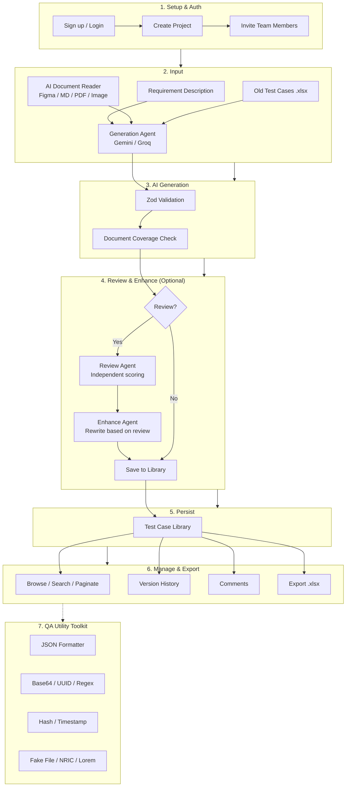

Built by **Jordan Le** (Le Van Anh Tan)
# QAJD — AI Test Case Generator & QA Toolkit

> An internal QA platform that leverages AI to generate test cases with an independent Senior QA Review Agent for coverage scoring, a project-based test case library, and a client-side QA Utility Toolkit.

[](https://nextjs.org/)
[](https://www.typescriptlang.org/)
[](https://tailwindcss.com/)
[](https://supabase.com/)
[](LICENSE)

---

## Table of Contents

- [System Overview](#system-overview)
- [Quick Start](#quick-start)
- [Features](#features)
- [Tech Stack](#tech-stack)
- [Project Structure](#project-structure)
- [System Architecture](#system-architecture)
- [Database Schema](#database-schema)
- [AI Generation Flow](#ai-generation-flow)
- [Prerequisites](#prerequisites)
- [Installation](#installation)
- [Environment Variables](#environment-variables)
- [Usage Guide](#usage-guide)
- [API Endpoints](#api-endpoints)
- [Core Principles](#core-principles)
- [Roadmap](#roadmap)
- [License](#license)

---

## System Overview



**QAJD** is a comprehensive QA toolkit designed to accelerate test case creation using AI while maintaining quality through an independent review mechanism. The platform supports:

- **AI-Powered Test Case Generation**: Input a requirement description and let the Generation Agent (Gemini/Groq) produce structured test cases.
- **Independent QA Review**: A separate Senior QA Review Agent evaluates coverage without shared context, then can enhance the set based on its own findings.
- **Test Case Library**: Organize test cases by project with version history, comments, and traceability.
- **QA Utility Toolkit**: Client-side tools — JSON formatting, Base64, UUID generation, Regex testing, Hashing, Timestamp conversion, Fake File generation, SG NRIC/FIN generation & validation, and Lorem Ipsum generation.
- **Team Collaboration**: Invite team members with role-based access (`qa`, `admin`).

---

## Quick Start

```bash
# 1. Clone & install
git clone https://github.com/AnhTan1420/QA-AI-Tool.git
cd QA-AI-Tool
npm install

# 2. Configure environment
cp .env.example .env.local
# Edit .env.local with your Supabase & AI provider keys

# 3. Initialize database
# Open Supabase SQL Editor → run schema.sql

# 4. Run dev server
npm run dev
# Open http://localhost:3000 → Register → Create Project → Generate
```

---

## Features

| Feature | Description |
|---------|-------------|
| AI Test Case Generation | Generate test cases from natural language requirements using Gemini or Groq |
| Senior QA Review & Enhance | An independent AI agent scores coverage, flags gaps/comments, and can auto-enhance the set based on its own review |
| Test Case Library | Browse, search, paginate, bulk-delete, and manage test cases per project |
| Version History | Every edit to a test case is tracked and viewable from the case detail page |
| Comments | Threaded comments on individual test cases |
| Old-Cases Import (Excel) | Upload an existing `.xlsx` test suite to review it, or feed it to the Generation Agent as reference |
| RAG Support | Vector embeddings for semantic search and retrieval (DB + `/api/ai/embed` ready, not yet wired into the UI) |
| QA Utilities | JSON formatter, Base64, UUID, Regex tester, Hash generator (SHA-1/256), Timestamp converter, Fake File generator, SG NRIC/FIN generator & validator, Lorem Ipsum generator |
| Team Management | Role-based project access (`qa` / `admin`) with email invitation |
| Bilingual UI | Full Vietnamese/English UI toggle (`components/layout/language-toggle.tsx`) |
| OAuth & Email Auth | Supabase Auth with Google OAuth and email/password |

---

## Tech Stack

```
Frontend:     Next.js 16 + React + TypeScript + Tailwind CSS
Backend:      Next.js API Routes + Server Components
Database:     Supabase PostgreSQL + pgvector
Auth:         Supabase Auth (Email/Password + Google OAuth)
AI/LLM:       Google Gemini + Groq (with automatic fallback)
Validation:   Zod (all AI I/O)
Deployment:   Vercel / Self-hosted
```

---

## Project Structure

> For the complete file-by-file breakdown, see [PROJECT_STRUCTURE.md](PROJECT_STRUCTURE.md).

```
QA-AI-Tool/
├── app/
│   ├── (auth)/                    # Login & Register pages
│   ├── (dashboard)/
│   │   ├── dashboard/             # Project & test case stats overview
│   │   ├── projects/              # Project list + create
│   │   │   └── [projectId]/
│   │   │       ├── generate/      # AI generation wizard
│   │   │       ├── test-cases/    # Test case library (list + detail)
│   │   │       └── team/          # Member management
│   │   └── tools/                 # QA Utility Toolkit
│   ├── api/
│   │   ├── ai/
│   │   │   ├── generate/          # Generation Agent
│   │   │   ├── enhance/           # Review / Enhance Agent
│   │   │   ├── documents/parse/   # AI Document Reader
│   │   │   └── embed/             # RAG embeddings
│   │   ├── ai-reviews/            # Persist review results
│   │   ├── projects/              # Project CRUD + members
│   │   ├── test-case-sets/        # Requirement + set creation
│   │   └── test-cases/            # Test case CRUD + comments + versions
│   ├── layout.tsx
│   └── page.tsx
├── components/
│   ├── auth/                      # Sign-out button
│   ├── layout/                    # Nav links, language toggle
│   ├── team/                      # Team management (hook + UI)
│   ├── test-case/                 # Generation wizard, version history, comments
│   ├── test-case-form/            # Create/edit test case form
│   ├── test-case-list/            # Library list view (hook + table + pagination)
│   └── tools/                     # QA Utility Toolkit (9 tools)
├── lib/
│   ├── ai/                        # LLM providers, prompts, parsing
│   ├── documents/                 # AI Document Reader helpers
│   ├── api/                       # Shared fetch helper
│   ├── i18n/                      # Vietnamese / English dictionaries
│   ├── validators/                # Zod schemas (test-case, document)
│   ├── utils/                     # Excel, fake files, NRIC, lorem ipsum
│   ├── supabase/                  # Browser / Server / Admin clients
│   └── test-case-taxonomy.ts      # Category/priority labels
├── public/
├── schema.sql                     # Full DB schema + RLS + triggers
├── proxy.ts                       # Session refresh + auth redirect
├── next.config.ts
├── tailwind.config.ts
├── tsconfig.json
└── package.json
```

> **Convention**: Any screen with non-trivial state lives as `components/<feature>/` with a `use-<feature>.ts` hook holding state + API calls, and small presentational `*.tsx` files. The route's `page.tsx` stays a thin orchestrator.

---

## System Architecture

### Architecture Layers

| Layer | Components | Responsibility |
|-------|-----------|--------------|
| **Client** | Browser, React Components | UI rendering, form input, client-side tools |
| **App Router** | `(auth)`, `(dashboard)`, `api/*` | Routing, SSR, API handlers |
| **AI Services** | Generation, Review, Enhance, Embed | LLM orchestration with fallback |
| **Data Layer** | Supabase PostgreSQL, Auth, Vector Store | Persistence, RLS, embeddings |
| **External** | Google OAuth, Gemini API, Groq API | Third-party integrations |

---

## Database Schema

### Entity Relationships

```
auth.users (1:1) ──► profiles (1:N) ──► projects (1:N) ──► test_case_sets (1:N) ──► test_cases
                                                          │                            │
                                                          ▼                            ▼
                                                    project_members           test_case_versions
                                                          │                            │
                                                          ▼                            ▼
                                                    requirements           test_case_embeddings
                                                                                   │
                                                                                   ▼
                                                                          requirement_traceability
```

### Key Design Decisions

- **`test_cases` has no direct `project_id`** — always join through `test_case_sets.project_id`. This enforces proper requirement grouping.
- **`profiles` auto-created via trigger** on `auth.users` insert — no manual step needed.
- **RLS policies** are the primary defense layer — API validates with Zod, but RLS prevents unauthorized access at the DB level.
- **`test_case_embeddings`** uses `pgvector` with `ivfflat` index for semantic search.

---

## AI Generation Flow

### Flow Description

1. **User Input** — Enter a requirement description in the generation wizard (optionally attach an old `.xlsx` test suite as reference)
2. **AI Document Reader (optional)** — Attach a Figma design (via link + Personal Access Token), a Markdown/logic-document/FS (`.md`/`.txt`/`.pdf`/`.docx`), or an ERD/diagram image; `/api/ai/documents/parse` atomizes it into `DocumentAtom`s (see `lib/validators/document.ts`)
3. **Generation Agent** — `/api/ai/generate` calls AI (Gemini, falling back to Groq) with the requirement, any RAG old cases, and any attached document atoms, and returns structured test cases. The Generation Agent is required to map every document atom into a test case's `source_requirement_ids` (PHASE 0.5 of the prompt); the API cross-checks this server-side and returns a `document_coverage` score alongside the test cases
4. **Zod Validation** — All AI output is parsed and validated against `lib/validators/test-case.ts` before it reaches the client
5. **Review (on demand)** — From the "Review & Enhance" tab, the user runs the independent Review Agent (`/api/ai/enhance`, `mode: "review"`) against the generated set (or an imported `.xlsx` set); it receives only the requirement + test cases, never the generation prompt or conversation history, and returns a coverage score, requirement gaps, and per-case comments
6. **Enhance (on demand)** — The user can then run `mode: "enhance"` to have the AI rewrite the set based on its own review
7. **Save to Library** — Validated test cases (and the review, if one was run) are stored via `/api/test-case-sets` + `/api/test-cases/bulk`, linked to a `test_case_set`

---

## Prerequisites

- **Node.js** 20+ (recommended: use `nvm` or `fnm`)
- **Supabase Project** (free tier sufficient for testing)
  - Enable `vector` extension
  - Enable `pgcrypto` extension
- **API Keys**:
  - **Google Gemini API Key** (required)
  - **Groq API Key** (recommended, used as fallback when Gemini rate-limits)

---

## Installation

### 1. Clone & Install

```bash
git clone https://github.com/AnhTan1420/QA-AI-Tool.git
cd QA-AI-Tool
npm install
```

### 2. Environment Setup

```bash
cp .env.example .env.local
```

Edit `.env.local` with your actual values (see Environment Variables).

### 3. Database Initialization

1. Open your Supabase project SQL Editor
2. Run the entire contents of `schema.sql`
3. This automatically:
   - Enables `vector` and `pgcrypto` extensions
   - Creates all tables with proper constraints
   - Sets up RLS policies
   - Creates trigger to auto-generate `profiles` on new user registration

### 4. Run Development Server

```bash
npm run dev
```

Open http://localhost:3000 and click **Register** to create your first account.

---

## AI Model

https://ai.google.dev/gemini-api/docs/models

## Environment Variables

```bash
# Supabase
NEXT_PUBLIC_SUPABASE_URL=https://your-project.supabase.co
NEXT_PUBLIC_SUPABASE_ANON_KEY=your-anon-key
SUPABASE_SERVICE_ROLE_KEY=your-service-role-key

# AI Providers
GOOGLE_GEMINI_API_KEY=your-gemini-api-key
GROQ_API_KEY=your-groq-api-key

# Model Configuration — read from env per task, never hardcoded (lib/ai/provider.ts)
AI_MODEL_GENERATION=gemini-3.6-flash
AI_MODEL_REVIEW=gemini-3.5-flash-lite
AI_MODEL_CLASSIFICATION=gemini-3.5-flash-lite
AI_MODEL_DOCUMENT_EXTRACTION=gemini-3.6-flash    # AI Document Reader (text + vision atomization) — must support multimodal input
AI_MODEL_FALLBACK=gemini-3.5-flash-lite    # used if a task-specific model isn't set
AI_MODEL_EMBEDDING=gemini-embedding-001     # used by /api/ai/embed (RAG, not yet wired into UI)
GROQ_MODEL_PRIMARY=llama-3.1-70b-versatile
GROQ_MODEL_FALLBACK=llama-3.1-8b-instant

# AI Document Reader (optional) — server-side fallback Figma token used when the
# user doesn't paste their own Personal Access Token in the generation wizard.
FIGMA_ACCESS_TOKEN=your-figma-personal-access-token
```

> Every task (`generation` / `review` / `classification`) tries its own Gemini model first, then `AI_MODEL_FALLBACK`, then Groq's `GROQ_MODEL_PRIMARY` → `GROQ_MODEL_FALLBACK` — see `lib/ai/provider.ts`.

> **Security Note**: `SUPABASE_SERVICE_ROLE_KEY` bypasses RLS. Only use it in server-side system operations (e.g., looking up users by email for invitations). Never expose it to the client.

---

## Usage Guide

### 1. Authentication

- Navigate to `/login` or `/register`
- Sign up with email/password or Google OAuth
- On first registration, a `profile` is auto-created via database trigger

### 2. Create a Project

1. Go to **Dashboard** → **Projects**
2. Click **Create Project**
3. Enter project name and description
4. You are automatically set as the project owner

### 3. Invite Team Members

1. Open a project → **Team** tab (admins only)
2. Enter member email and select role:
   - `qa` — Can generate and view test cases
   - `admin` — Full project management (invite/remove members, change roles)
3. Click **Invite**

### 4. Generate Test Cases with AI

1. Inside a project, go to **Generate**
2. Enter requirement description (e.g. *"User should be able to reset password via email link"*), pick categories, and optionally upload an old `.xlsx` test suite as reference
3. (Optional) In the **AI Document Reader** step, attach a Figma design (paste the file link + a Figma Personal Access Token), or upload a Markdown/logic-document/Functional Spec (`.md`/`.txt`/`.pdf`/`.docx`) or an ERD/diagram image (`.png`/`.jpg`) — each is atomized into testable elements the Generation Agent must map into the resulting test cases
4. Click **Generate** — the Generation Agent returns a validated set of test cases, shown in the **Test Cases Generated** tab; if any documents were attached, a **document mapping coverage** banner shows the resulting % and lists any unmapped elements
5. Switch to the **Review & Enhance** tab to run the independent Review Agent (coverage score, requirement gaps, per-case comments), then optionally **Enhance with AI** to have it rewrite the set based on its own review
6. Click **Save to Library** to persist the set (and review, if run)

### 5. Browse Test Case Library

1. Go to **Test Cases** inside a project
2. Search, paginate, bulk-select and bulk-delete, or change a case's status inline
3. Click any test case to see:
   - Title, steps, expected result, priority and status
   - **Version History** — every past edit
   - **Comments** — threaded discussion on that case

### 6. Use QA Utility Toolkit

1. Go to **Tools** in the sidebar
2. Available utilities:
   - **JSON Formatter** — Pretty-print and validate JSON
   - **Base64** — Encode/decode strings
   - **UUID Generator** — Generate v4 UUIDs in bulk
   - **Regex Tester** — Test patterns with live matching
   - **Hash Generator** — SHA-1, SHA-256
   - **Timestamp Converter** — Unix ↔ ISO 8601
   - **Fake File Generator** — Generate dummy files (TXT, CSV, JSON, PNG, PDF) at chosen size for upload testing
   - **Singapore NRIC/FIN Generator & Validator** — Generate and checksum-validate Singapore NRIC/FIN numbers for test data
   - **Dummy Text Generator** — Generate placeholder text by word/sentence/paragraph count

---

## API Endpoints

| Endpoint | Method | Description |
|----------|--------|-------------|
| `/api/ai/generate` | `POST` | Generate test cases from a requirement description |
| `/api/ai/enhance` | `POST` | Review (`mode: "review"`) or rewrite (`mode: "enhance"`) a set of test cases |
| `/api/ai/documents/parse` | `POST` | AI Document Reader — atomize a Figma file, a Markdown/logic-doc/FS (.md/.txt/.pdf/.docx), or an ERD/diagram image into `DocumentAtom`s for the Generation Agent |
| `/api/ai/embed` | `POST` | Create a vector embedding for RAG (backend ready, not yet called by the UI) |
| `/api/ai-reviews` | `POST` | Persist a review result against a test case set |
| `/api/projects` | `GET`/`POST` | List / create projects |
| `/api/projects/[projectId]` | `DELETE` | Delete a project |
| `/api/projects/[projectId]/members` | `GET`/`POST`/`PATCH`/`DELETE` | List, invite, change role, or remove a project member |
| `/api/test-case-sets` | `POST` | Create a test case set (requirement) |
| `/api/test-cases` | `GET`/`POST`/`PATCH`/`DELETE` | List, create, update (status), or bulk-delete test cases |
| `/api/test-cases/bulk` | `POST` | Bulk create/update test cases |
| `/api/test-cases/export` | `GET` | Export a project's test cases |
| `/api/test-cases/[id]` | `GET`/`PUT`/`DELETE` | Get, update, or delete a single test case |
| `/api/test-cases/[id]/comments` | `GET`/`POST` | List / add comments on a test case |
| `/api/test-cases/[id]/versions` | `GET` | Version history for a test case |

### Example: Generate Test Cases

```bash
curl -X POST http://localhost:3000/api/ai/generate \
  -H "Content-Type: application/json" \
  -d '{
    "requirement_description": "User can add items to cart and checkout",
    "selected_categories": ["positive", "negative", "boundary"],
    "language": "English",
    "detail_level": "standard",
    "retrieved_old_test_cases": []
  }'
```

### Example: Review Coverage

```bash
curl -X POST http://localhost:3000/api/ai/enhance \
  -H "Content-Type: application/json" \
  -d '{
    "mode": "review",
    "requirement_description": "User can add items to cart and checkout",
    "test_cases": [
      {"code": "TC_CART_001", "title": "Add single item to cart", "...": "..."}
    ]
  }'
```

---

## Core Principles

When contributing or modifying code, adhere to these principles:

### 1. Never Trust Raw AI JSON

Every response from Gemini/Groq must pass through `lib/validators/test-case.ts` before database write or client response. See `app/api/ai/generate/route.ts` for the implementation pattern.

```typescript
const validated = TestCaseSchema.parse(aiResponse);
// Only then save to DB
```

### 2. Review Agent Must Be Independent

- **Do not** pass previously generated test cases as reference
- **Do not** share conversation history with the Generation Agent
- The Review Agent must evaluate objectively without bias

### 3. No Hard-Coded Model IDs

Always read model identifiers from environment variables:

```typescript
const model = process.env.AI_MODEL_GENERATION; // ✅
// const model = "gemini-1.5-pro"; // ❌ Never do this
```

Model routing tries the Gemini model for the task, then `AI_MODEL_FALLBACK`, then falls back to Groq entirely (see `lib/ai/provider.ts`).

### 4. Test Cases Join Through Sets

`test_cases` has no `project_id` column. Always join:

```sql
SELECT tc.*
FROM test_cases tc
JOIN test_case_sets tcs ON tc.test_case_set_id = tcs.id
WHERE tcs.project_id = 'uuid';
```

### 5. RLS Is the Primary Defense

- API route handlers validate input with Zod
- But **RLS policies** enforce access control at the database level
- Never bypass RLS with `supabase/admin.ts` except for true system operations (e.g., email lookup in `auth.users`)

---

## Roadmap

### Phase 2 — In Progress

- **RAG Pipeline** — Complete flow: upload old test cases → auto-embed → retrieve during generation
- **Requirement Traceability Matrix** — `requirement_traceability` table exists, needs UI
- **AI Document Reader** — Reads and parses Figma designs (live via the Figma REST API), Markdown docs, logic documents, Functional Specifications (FS), ERD, and diagrams (PDF/DOCX/image) for smarter test case generation. Each source is "atomized" into `DocumentAtom`s (`lib/validators/document.ts`); the Generation Agent is required to map every atom into a test case's `source_requirement_ids` (PHASE 0.5 of `lib/ai/prompts/generation-agent.ts`), and `/api/ai/generate` cross-checks that mapping server-side (`lib/documents/coverage.ts`) and returns a `document_coverage` score instead of just trusting the model's word. See `components/test-case/generate-workspace/document-reader-panel.tsx` and `app/api/ai/documents/parse/route.ts`.
- **Can access project environment** — read the UI, auto create test data

### Phase 3 — Planned

- **Automation test with AI**
  1. Open a test case detail
  2. Click **Generate Cypress Code**
  3. The AI will produce executable TypeScript code
  4. Copy and use in test suite

---

## License

MIT License — see [LICENSE](LICENSE) for details.

---

Built by **Jordan Le** (Le Van Anh Tan)
