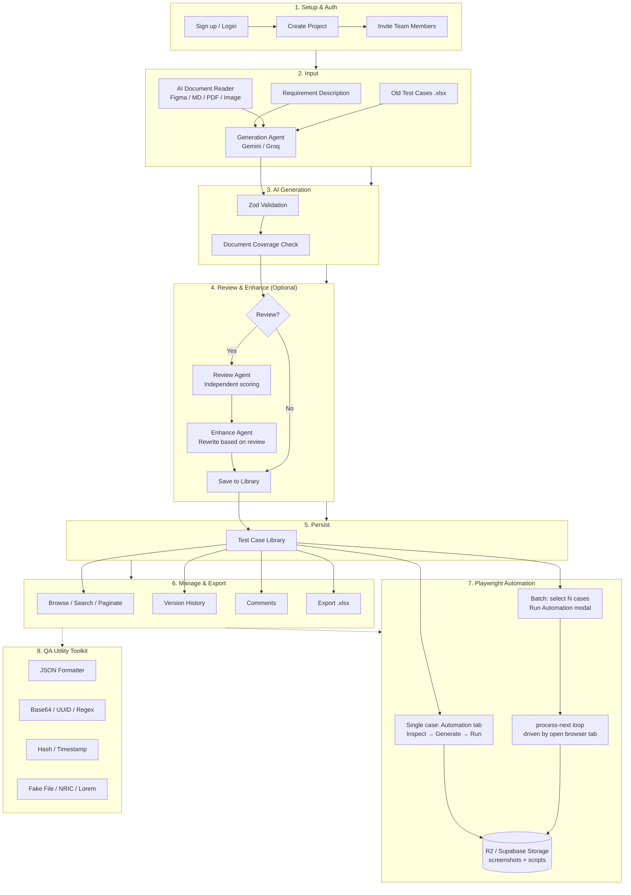

Built by **Jordan Le** (Le Van Anh Tan)
# QAJD — AI Test Case Generator & QA Toolkit

> An internal QA platform that leverages AI to generate test cases with an independent Senior QA Review Agent for coverage scoring, a project-based test case library, an AI-grounded Playwright automation agent (single-case and batch), and a client-side QA Utility Toolkit.

[](https://nextjs.org/)
[](https://www.typescriptlang.org/)
[](https://tailwindcss.com/)
[](https://supabase.com/)
[](LICENSE)

---

## Table of Contents

- [System Overview](#system-overview)
- [Quick Start](#quick-start)
- [Features](#features)
- [Tech Stack](#tech-stack)
- [Project Structure](#project-structure)
- [System Architecture](#system-architecture)
- [Database Schema](#database-schema)
- [AI Generation Flow](#ai-generation-flow)
- [Automation Flow (Single Test Case)](#automation-flow-single-test-case)
- [Batch Automation Flow](#batch-automation-flow)
- [Prerequisites](#prerequisites)
- [Installation](#installation)
- [Environment Variables](#environment-variables)
- [Usage Guide](#usage-guide)
- [API Endpoints](#api-endpoints)
- [Core Principles](#core-principles)
- [Roadmap](#roadmap)
- [License](#license)

---

## System Overview



**QAJD** is a comprehensive QA toolkit designed to accelerate test case creation using AI while maintaining quality through an independent review mechanism, and to turn approved test cases directly into runnable browser automation. The platform supports:

- **AI-Powered Test Case Generation**: Input a requirement description and let the Generation Agent (Gemini/Groq) produce structured test cases.
- **Independent QA Review**: A separate Senior QA Review Agent evaluates coverage without shared context, then can enhance the set based on its own findings.
- **Test Case Library**: Organize test cases by project with version history, comments, and traceability.
- **Playwright Automation Agent**: Generate, run, and maintain real `@playwright/test` scripts grounded in a server-inspected DOM/element map — one test case at a time from its Automation tab, or in **batch** across many selected test cases at once.
- **Reusable Project Environments**: Save non-secret automation targets (browser + target URL + auth mode) per project so they don't need to be retyped for every run.
- **QA Utility Toolkit**: Client-side tools — JSON formatting, Base64, UUID generation, Regex testing, Hashing, Timestamp conversion, Fake File generation, SG NRIC/FIN generation & validation, and Lorem Ipsum generation.
- **Team Collaboration**: Invite team members with role-based access (`qa`, `admin`).

---

## Quick Start

```bash
# 1. Clone & install
git clone https://github.com/AnhTan1420/QA-AI-Tool.git
cd QA-AI-Tool
npm install

# 2. Configure environment
cp .env.example .env.local
# Edit .env.local with your Supabase, AI provider, and (optional) R2 keys

# 3. Initialize database
# Open Supabase SQL Editor → run schema.sql

# 4. Run dev server
npm run dev
# Open http://localhost:3000 → Register → Create Project → Generate
```

---

## Features

| Feature | Description |
|---------|-------------|
| AI Test Case Generation | Generate test cases from natural language requirements using Gemini or Groq |
| Senior QA Review & Enhance | An independent AI agent scores coverage, flags gaps/comments, and can auto-enhance the set based on its own review |
| Test Case Library | Browse, search, paginate, bulk-delete, and manage test cases per project |
| Version History | Every edit to a test case is tracked and viewable from the case detail page |
| Comments | Threaded comments on individual test cases |
| Old-Cases Import (Excel) | Upload an existing `.xlsx` test suite to review it, or feed it to the Generation Agent as reference |
| RAG Support | Vector embeddings for semantic search and retrieval (DB + `/api/ai/embed` ready, not yet wired into the UI) |
| QA Utilities | JSON formatter, Base64, UUID, Regex tester, Hash generator (SHA-1/256), Timestamp converter, Fake File generator, SG NRIC/FIN generator & validator, Lorem Ipsum generator |
| Team Management | Role-based project access (`qa` / `admin`) with email invitation |
| Playwright Automation Agent | Generate, run, and maintain Playwright TypeScript automation scripts from any test case — grounded in a real, server-inspected DOM/element map, with screenshot capture and an annotated failure callout on the "Automation" tab |
| Batch Automation | Select any number of test cases from the library and run automation on all of them against a saved environment, with a resumable progress panel (queued/running/passed/failed/error/skipped per item) |
| Project Environments | Save reusable, non-secret automation targets (name, browser, target URL, auth mode) per project — reused by both single-case and batch runs |
| Screenshot & Script Storage | Run screenshots and generated scripts upload to Cloudflare R2 when configured, with automatic fallback to Supabase Storage; signed URLs are always re-derived fresh (never cached expired) |
| Bilingual UI | Full Vietnamese/English UI toggle (`components/layout/language-toggle.tsx`) |
| OAuth & Email Auth | Supabase Auth with Google OAuth and email/password |

---

## Tech Stack

```
Frontend:     Next.js 16 + React 19 + TypeScript + Tailwind CSS 4
Backend:      Next.js API Routes + Server Components
Database:     Supabase PostgreSQL + pgvector
Auth:         Supabase Auth (Email/Password + Google OAuth)
AI/LLM:       Google Gemini (@google/genai) + Groq (groq-sdk), with automatic fallback
Automation:   Playwright (playwright-core + @sparticuz/chromium on serverless, full `playwright` when self-hosted)
Storage:      Cloudflare R2 (S3-compatible, via @aws-sdk/client-s3) for screenshots/scripts, Supabase Storage as fallback
Validation:   Zod (all AI I/O and automation config)
Testing:      Vitest
Deployment:   Vercel (Hobby-tier compatible) / Self-hosted
```

---

## Project Structure

> For the complete file-by-file breakdown, see [PROJECT_STRUCTURE.md](PROJECT_STRUCTURE.md).

```
QA-AI-Tool/
├── app/
│   ├── (auth)/                    # Login & Register pages
│   ├── (dashboard)/
│   │   ├── dashboard/             # Project & test case stats overview
│   │   ├── projects/              # Project list + create
│   │   │   └── [projectId]/
│   │   │       ├── generate/      # AI generation wizard
│   │   │       ├── test-cases/    # Test case library (list + detail, incl. Automation tab, batch run trigger)
│   │   │       ├── automation/
│   │   │       │   └── environments/  # Manage saved project automation environments
│   │   │       └── team/          # Member management
│   │   └── tools/                 # QA Utility Toolkit
│   ├── api/
│   │   ├── ai/
│   │   │   ├── generate/          # Generation Agent
│   │   │   ├── enhance/           # Review / Enhance Agent
│   │   │   ├── documents/parse/   # AI Document Reader
│   │   │   ├── embed/             # RAG embeddings
│   │   │   └── playwright/        # Playwright Codegen Agent
│   │   ├── ai-reviews/            # Persist review results
│   │   ├── projects/              # Project CRUD + members + environments
│   │   ├── test-case-sets/        # Requirement + set creation
│   │   ├── automation/            # Inspect, single run, batch-run + process-next, run screenshot
│   │   └── test-cases/            # Test case CRUD + comments + versions + automation scripts/runs
│   ├── layout.tsx
│   └── page.tsx
├── components/
│   ├── auth/                      # Sign-out button
│   ├── automation/                # Batch run modal, progress panel, environments management hooks/UI
│   ├── layout/                    # Nav links, language toggle
│   ├── team/                      # Team management (hook + UI)
│   ├── test-case/                 # Generation wizard, version history, comments, single-case Automation tab
│   ├── test-case-form/            # Create/edit test case form
│   ├── test-case-list/            # Library list view (hook + table + pagination + batch-run trigger)
│   └── tools/                     # QA Utility Toolkit (9 tools)
├── lib/
│   ├── ai/                        # LLM providers, prompts, parsing
│   ├── automation/                # Browser runner (inspect + run), batch runner, R2/Supabase storage, rate limiter
│   ├── documents/                 # AI Document Reader helpers
│   ├── api/                       # Shared fetch helper
│   ├── i18n/                      # Vietnamese / English dictionaries
│   ├── validators/                # Zod schemas (test-case, document, playwright/automation)
│   ├── utils/                     # Excel, fake files, NRIC, lorem ipsum
│   ├── supabase/                  # Browser / Server / Admin clients
│   └── test-case-taxonomy.ts      # Category/priority labels
├── public/
├── schema.sql                     # Full DB schema + RLS + triggers (incl. batch automation tables)
├── proxy.ts                       # Session refresh + auth redirect
├── next.config.ts
├── tailwind.config.ts
├── tsconfig.json
└── package.json
```

> **Convention**: Any screen with non-trivial state lives as `components/<feature>/` with a `use-<feature>.ts` hook holding state + API calls, and small presentational `*.tsx` files. The route's `page.tsx` stays a thin orchestrator.

---

## System Architecture

### Architecture Layers

| Layer | Components | Responsibility |
|-------|-----------|--------------|
| **Client** | Browser, React Components | UI rendering, form input, client-side tools, batch-run polling loop |
| **App Router** | `(auth)`, `(dashboard)`, `api/*` | Routing, SSR, API handlers |
| **AI Services** | Generation, Review, Enhance, Embed, Playwright Codegen | LLM orchestration with fallback |
| **Automation Runner** | `lib/automation/*` | Headless-browser inspection & script execution, batch item processing, rate limiting |
| **Data Layer** | Supabase PostgreSQL, Auth, Vector Store | Persistence, RLS, embeddings |
| **Storage** | Cloudflare R2 (primary), Supabase Storage (fallback) | Screenshots & generated scripts, signed URLs |
| **External** | Google OAuth, Gemini API, Groq API, Figma API | Third-party integrations |

---

## Database Schema

### Entity Relationships

```
auth.users (1:1) ──► profiles (1:N) ──► projects (1:N) ──► test_case_sets (1:N) ──► test_cases
                                            │                │                            │
                                            ▼                ▼                            ▼
                                    project_members   project_environments        test_case_versions
                                            │                │                            │
                                            ▼                ▼                            ▼
                                     requirements   automation_batch_runs        test_case_embeddings
                                                            │                            │
                                                            ▼                            ▼
                                                automation_batch_run_items   requirement_traceability

test_cases (1:N) ──► automation_scripts (versions)
test_cases (1:N) ──► automation_runs (pass/fail history, screenshot_url)
```

### Key Design Decisions

- **`test_cases` has no direct `project_id`** — always join through `test_case_sets.project_id`. This enforces proper requirement grouping.
- **`profiles` auto-created via trigger** on `auth.users` insert — no manual step needed.
- **RLS policies** are the primary defense layer — API validates with Zod, but RLS prevents unauthorized access at the DB level.
- **`test_case_embeddings`** uses `pgvector` with `ivfflat` index for semantic search.
- **`project_environments` never stores secrets** — only name, browser, target URL, and which auth mode (`none`/`cookie`/`login`) to prompt for. Cookie tokens and login credentials are supplied fresh at run time and never persisted.
- **`automation_batch_runs` / `automation_batch_run_items`** track a batch as a resumable queue (`queued` → `running` → `passed`/`failed`/`error`/`skipped`), advanced one item per request — see [Batch Automation Flow](#batch-automation-flow).

---

## AI Generation Flow

### Flow Description

1. **User Input** — Enter a requirement description in the generation wizard (optionally attach an old `.xlsx` test suite as reference)
2. **AI Document Reader (optional)** — Attach a Figma design (via link + Personal Access Token), a Markdown/logic-document/FS (`.md`/`.txt`/`.pdf`/`.docx`), or an ERD/diagram image; `/api/ai/documents/parse` atomizes it into `DocumentAtom`s (see `lib/validators/document.ts`)
3. **Generation Agent** — `/api/ai/generate` calls AI (Gemini, falling back to Groq) with the requirement, any RAG old cases, and any attached document atoms, and returns structured test cases. The Generation Agent is required to map every document atom into a test case's `source_requirement_ids` (PHASE 0.5 of the prompt); the API cross-checks this server-side and returns a `document_coverage` score alongside the test cases
4. **Zod Validation** — All AI output is parsed and validated against `lib/validators/test-case.ts` before it reaches the client
5. **Review (on demand)** — From the "Review & Enhance" tab, the user runs the independent Review Agent (`/api/ai/enhance`, `mode: "review"`) against the generated set (or an imported `.xlsx` set); it receives only the requirement + test cases, never the generation prompt or conversation history, and returns a coverage score, requirement gaps, and per-case comments
6. **Enhance (on demand)** — The user can then run `mode: "enhance"` to have the AI rewrite the set based on its own review
7. **Save to Library** — Validated test cases (and the review, if one was run) are stored via `/api/test-case-sets` + `/api/test-cases/bulk`, linked to a `test_case_set`

---

## Automation Flow (Single Test Case)

1. Open a test case detail → **Automation** tab
2. Configure the environment (browser, target URL, optional cookie/session token or login credentials) — or pick a saved **Project Environment**
3. **Inspect** — `/api/automation/inspect` launches a real headless browser server-side, navigates + authenticates, and extracts a DOM/element map (role, accessible name, `data-testid`/id, tag)
4. **Generate** — `/api/ai/playwright` (Playwright Codegen Agent) produces a complete `@playwright/test` TypeScript file grounded in that element map — never a hallucinated selector — saved as a new `automation_scripts` version
5. **Run** — `/api/automation/run` executes the script; on pass, the final-state screenshot is stored, on fail the failing element is highlighted alongside structured failure details (error message, selector, step). Runs are rate-limited per user (`lib/automation/rate-limit.ts`) since each one holds a real browser instance
6. Screenshots and scripts upload to **Cloudflare R2** when configured, falling back to **Supabase Storage** otherwise (`lib/automation/screenshot-storage.ts`, `lib/automation/r2-storage.ts`); the `/api/automation/runs/[runId]/screenshot` route always re-derives a fresh signed URL rather than trusting a cached one
7. Every generation is kept as a version (`automation_scripts`) and every run is kept in history (`automation_runs`), both visible from the same tab — an "Automation" status badge also shows on the test case in the library list

---

## Batch Automation Flow

Runs automation across many selected test cases at once, without a dedicated server-side worker (see the architecture note below):

1. From the **Test Cases** library, select any number of test cases and click **Run Automation** → choose (or create) a saved **Project Environment**
2. `/api/automation/batch-run` (`POST`) enqueues the batch: it inserts one `automation_batch_runs` row plus one `automation_batch_run_items` row per selected test case, then returns immediately — it does **not** run anything itself
3. The open browser tab drives the queue by repeatedly calling `/api/automation/batch-run/[id]/process-next`, which claims and processes **exactly one** queued item per call via `lib/automation/batch-runner.ts`:
   - reuses the test case's latest saved `automation_scripts` version if one exists, otherwise Inspects the environment and Generates a script first
   - always Runs the script and persists the result to `automation_runs`, exactly like the single-case flow
4. The **Batch Progress Panel** (`components/automation/batch-progress-panel.tsx`) shows live per-item status (`queued` / `running` / `passed` / `failed` / `error` / `skipped`) as the tab keeps polling
5. **Fully resumable**: closing the tab simply pauses the batch at whatever is still `queued` — reopening it and clicking Resume continues from there. This is a deliberate design constraint for the Vercel Hobby tier (hard 60s `maxDuration`, no background worker, and Cron limited to once/day — see the "Batch Automation" header comment in `schema.sql`), not a bug
6. Credentials (cookie token or login) are entered once at batch start, held only in browser memory for the batch's lifetime, and resent with every `process-next` call — never written to `automation_batch_run_items` or `automation_batch_runs`

---

## Prerequisites

- **Node.js** 20+ (recommended: use `nvm` or `fnm`)
- **Supabase Project** (free tier sufficient for testing)
  - Enable `vector` extension
  - Enable `pgcrypto` extension
- **API Keys**:
  - **Google Gemini API Key** (required)
  - **Groq API Key** (recommended, used as fallback when Gemini rate-limits)
- **Cloudflare R2** (optional) — for persistent screenshot/script storage; without it, the app falls back to Supabase Storage automatically

---

## Installation

### 1. Clone & Install

```bash
git clone https://github.com/AnhTan1420/QA-AI-Tool.git
cd QA-AI-Tool
npm install
```

### 2. Environment Setup

```bash
cp .env.example .env.local
```

Edit `.env.local` with your actual values (see Environment Variables).

### 3. Database Initialization

1. Open your Supabase project SQL Editor
2. Run the entire contents of `schema.sql`
3. This automatically:
   - Enables `vector` and `pgcrypto` extensions
   - Creates all tables with proper constraints, including `project_environments`, `automation_scripts`, `automation_runs`, `automation_batch_runs`, and `automation_batch_run_items`
   - Sets up RLS policies
   - Creates trigger to auto-generate `profiles` on new user registration
   - Creates the `automation-screenshots` storage bucket + policies (used when R2 is not configured)

### 4. (Optional) Configure Cloudflare R2

See [CLOUDFLARE_R2_SETUP.md](CLOUDFLARE_R2_SETUP.md) for creating the bucket, API token, and (optional) public domain. If the `R2_*` variables aren't set, screenshots and scripts automatically fall back to Supabase Storage — no code changes needed.

### 5. Run Development Server

```bash
npm run dev
```

Open http://localhost:3000 and click **Register** to create your first account.

---

## AI Model

https://ai.google.dev/gemini-api/docs/models

## Environment Variables

```bash
# Supabase
NEXT_PUBLIC_SUPABASE_URL=https://your-project.supabase.co
NEXT_PUBLIC_SUPABASE_ANON_KEY=your-anon-key
SUPABASE_SERVICE_ROLE_KEY=your-service-role-key

# AI Providers
GOOGLE_GEMINI_API_KEY=your-gemini-api-key
GROQ_API_KEY=your-groq-api-key

# Model Configuration — read from env per task, never hardcoded (lib/ai/provider.ts)
AI_MODEL_GENERATION=gemini-3.6-flash
AI_MODEL_REVIEW=gemini-3.5-flash-lite
AI_MODEL_CLASSIFICATION=gemini-3.5-flash-lite
AI_MODEL_DOCUMENT_EXTRACTION=gemini-3.6-flash    # AI Document Reader (text + vision atomization) — must support multimodal input
AI_MODEL_FALLBACK=gemini-3.5-flash-lite    # used if a task-specific model isn't set
AI_MODEL_EMBEDDING=gemini-embedding-001     # used by /api/ai/embed (RAG, not yet wired into UI)
GROQ_MODEL_PRIMARY=llama-3.1-70b-versatile
GROQ_MODEL_FALLBACK=llama-3.1-8b-instant

# AI Document Reader (optional) — server-side fallback Figma token used when the
# user doesn't paste their own Personal Access Token in the generation wizard.
FIGMA_ACCESS_TOKEN=your-figma-personal-access-token

# Playwright Automation Agent (single case + batch) — see lib/automation/browser-runner.ts
AI_MODEL_PLAYWRIGHT_CODEGEN=gemini-3.6-flash
AUTOMATION_RUNTIME=serverless   # 'serverless' (Chromium only, default on Vercel) or 'local' (all 3 engines — self-hosted only)

# Cloudflare R2 (optional) — persistent storage for automation screenshots + scripts.
# If any of these are unset, storage falls back to Supabase Storage automatically.
# See CLOUDFLARE_R2_SETUP.md for full setup instructions.
R2_ACCOUNT_ID=your-cloudflare-account-id
R2_ACCESS_KEY_ID=your-r2-access-key-id
R2_SECRET_ACCESS_KEY=your-r2-secret-access-key
R2_BUCKET_NAME=qa-automation-assets
# R2_PUBLIC_URL=https://pub-abc123.r2.dev   # optional: public bucket domain, skips signed-URL generation
```

> Every task (`generation` / `review` / `classification`) tries its own Gemini model first, then `AI_MODEL_FALLBACK`, then Groq's `GROQ_MODEL_PRIMARY` → `GROQ_MODEL_FALLBACK` — see `lib/ai/provider.ts`.

> **Security Note**: `SUPABASE_SERVICE_ROLE_KEY` bypasses RLS. Only use it in server-side system operations (e.g., looking up users by email for invitations). Never expose it to the client.

---

## Usage Guide

### 1. Authentication

- Navigate to `/login` or `/register`
- Sign up with email/password or Google OAuth
- On first registration, a `profile` is auto-created via database trigger

### 2. Create a Project

1. Go to **Dashboard** → **Projects**
2. Click **Create Project**
3. Enter project name and description
4. You are automatically set as the project owner

### 3. Invite Team Members

1. Open a project → **Team** tab (admins only)
2. Enter member email and select role:
   - `qa` — Can generate and view test cases
   - `admin` — Full project management (invite/remove members, change roles)
3. Click **Invite**

### 4. Generate Test Cases with AI

1. Inside a project, go to **Generate**
2. Enter requirement description (e.g. *"User should be able to reset password via email link"*), pick categories, and optionally upload an old `.xlsx` test suite as reference
3. (Optional) In the **AI Document Reader** step, attach a Figma design (paste the file link + a Figma Personal Access Token), or upload a Markdown/logic-document/Functional Spec (`.md`/`.txt`/`.pdf`/`.docx`) or an ERD/diagram image (`.png`/`.jpg`) — each is atomized into testable elements the Generation Agent must map into the resulting test cases
4. Click **Generate** — the Generation Agent returns a validated set of test cases, shown in the **Test Cases Generated** tab; if any documents were attached, a **document mapping coverage** banner shows the resulting % and lists any unmapped elements
5. Switch to the **Review & Enhance** tab to run the independent Review Agent (coverage score, requirement gaps, per-case comments), then optionally **Enhance with AI** to have it rewrite the set based on its own review
6. Click **Save to Library** to persist the set (and review, if run)

### 5. Browse Test Case Library

1. Go to **Test Cases** inside a project
2. Search, paginate, bulk-select and bulk-delete, or change a case's status inline
3. Click any test case to see:
   - Title, steps, expected result, priority and status
   - **Version History** — every past edit
   - **Comments** — threaded discussion on that case

### 6. Automate a Single Test Case

1. Open a test case detail → **Automation** tab
2. Configure the test environment (browser, target URL, optional cookie/session token or login credentials), or pick a saved **Project Environment**, then click **Inspect target page**
3. Click **Generate Playwright Code** — grounded in the inspected element map, shown with syntax highlighting and a **Copy** button for your external suite
4. Click **Run Automation Test** to execute it inside QAJD — pass stores a final-state screenshot, fail highlights the failing element with structured failure details
5. Every generation is versioned (`automation_scripts`) and every run kept in history (`automation_runs`), both visible from the same tab; an "Automation" status badge also shows on the test case in the library list

### 7. Run Batch Automation

1. Go to **Test Cases** inside a project, select the test cases to automate (checkboxes), and click **Run Automation**
2. Pick a saved **Project Environment** (or create one under **Automation → Environments**) and, if it requires auth, enter the cookie token or login credentials for this run
3. Keep the tab open — the **Batch Progress Panel** shows each item moving through `queued` → `running` → `passed`/`failed`/`error`/`skipped` as it works through the queue one test case at a time
4. If you close the tab mid-run, the batch simply pauses; reopen it and click **Resume** to continue from where it left off

### 8. Use QA Utility Toolkit

1. Go to **Tools** in the sidebar
2. Available utilities:
   - **JSON Formatter** — Pretty-print and validate JSON
   - **Base64** — Encode/decode strings
   - **UUID Generator** — Generate v4 UUIDs in bulk
   - **Regex Tester** — Test patterns with live matching
   - **Hash Generator** — SHA-1, SHA-256
   - **Timestamp Converter** — Unix ↔ ISO 8601
   - **Fake File Generator** — Generate dummy files (TXT, CSV, JSON, PNG, PDF) at chosen size for upload testing
   - **Singapore NRIC/FIN Generator & Validator** — Generate and checksum-validate Singapore NRIC/FIN numbers for test data
   - **Dummy Text Generator** — Generate placeholder text by word/sentence/paragraph count

---

## API Endpoints

| Endpoint | Method | Description |
|----------|--------|-------------|
| `/api/ai/generate` | `POST` | Generate test cases from a requirement description |
| `/api/ai/enhance` | `POST` | Review (`mode: "review"`) or rewrite (`mode: "enhance"`) a set of test cases |
| `/api/ai/documents/parse` | `POST` | AI Document Reader — atomize a Figma file, a Markdown/logic-doc/FS (.md/.txt/.pdf/.docx), or an ERD/diagram image into `DocumentAtom`s for the Generation Agent |
| `/api/ai/embed` | `POST` | Create a vector embedding for RAG (backend ready, not yet called by the UI) |
| `/api/ai/playwright` | `POST` | Playwright Codegen Agent — generate a `@playwright/test` script grounded in an inspected element map, saved as a new `automation_scripts` version |
| `/api/automation/inspect` | `POST` | Launch a real browser server-side, navigate + auth, and extract a DOM/element map |
| `/api/automation/run` | `POST` | Execute a generated (or ad-hoc) Playwright script and capture a screenshot + failure details into `automation_runs`; rate-limited per user |
| `/api/automation/batch-run` | `POST` | Enqueue a batch: create `automation_batch_runs` + one `automation_batch_run_items` row per selected test case |
| `/api/automation/batch-run/[id]/process-next` | `POST` | Claim and process exactly one queued item in a batch (Inspect+Generate if needed, then Run) — called repeatedly by the browser tab until the queue is empty |
| `/api/automation/runs/[runId]/screenshot` | `GET` | Re-derive and redirect to a fresh signed URL for a run's stored screenshot (R2 or Supabase) |
| `/api/test-cases/[id]/automation/scripts` | `GET` | Version history of generated Playwright scripts for a test case |
| `/api/test-cases/[id]/automation/runs` | `GET` | Run history (pass/fail, screenshots, failure details) for a test case |
| `/api/ai-reviews` | `POST` | Persist a review result against a test case set |
| `/api/projects` | `GET`/`POST` | List / create projects |
| `/api/projects/[projectId]` | `DELETE` | Delete a project |
| `/api/projects/[projectId]/members` | `GET`/`POST`/`PATCH`/`DELETE` | List, invite, change role, or remove a project member |
| `/api/projects/[projectId]/environments` | `GET`/`POST` | List / create saved, non-secret automation environments for a project |
| `/api/test-case-sets` | `POST` | Create a test case set (requirement) |
| `/api/test-cases` | `GET`/`POST`/`PATCH`/`DELETE` | List, create, update (status), or bulk-delete test cases |
| `/api/test-cases/bulk` | `POST` | Bulk create/update test cases |
| `/api/test-cases/export` | `GET` | Export a project's test cases |
| `/api/test-cases/[id]` | `GET`/`PUT`/`DELETE` | Get, update, or delete a single test case |
| `/api/test-cases/[id]/comments` | `GET`/`POST` | List / add comments on a test case |
| `/api/test-cases/[id]/versions` | `GET` | Version history for a test case |

### Example: Generate Test Cases

```bash
curl -X POST http://localhost:3000/api/ai/generate \
  -H "Content-Type: application/json" \
  -d '{
    "requirement_description": "User can add items to cart and checkout",
    "selected_categories": ["positive", "negative", "boundary"],
    "language": "English",
    "detail_level": "standard",
    "retrieved_old_test_cases": []
  }'
```

### Example: Review Coverage

```bash
curl -X POST http://localhost:3000/api/ai/enhance \
  -H "Content-Type: application/json" \
  -d '{
    "mode": "review",
    "requirement_description": "User can add items to cart and checkout",
    "test_cases": [
      {"code": "TC_CART_001", "title": "Add single item to cart", "...": "..."}
    ]
  }'
```

### Example: Enqueue a Batch Automation Run

```bash
curl -X POST http://localhost:3000/api/automation/batch-run \
  -H "Content-Type: application/json" \
  -d '{
    "project_id": "uuid-of-project",
    "test_case_ids": ["uuid-1", "uuid-2", "uuid-3"],
    "environment_id": "uuid-of-saved-environment"
  }'
```

---

## Core Principles

When contributing or modifying code, adhere to these principles:

### 1. Never Trust Raw AI JSON

Every response from Gemini/Groq must pass through `lib/validators/test-case.ts` before database write or client response. See `app/api/ai/generate/route.ts` for the implementation pattern.

```typescript
const validated = TestCaseSchema.parse(aiResponse);
// Only then save to DB
```

### 2. Review Agent Must Be Independent

- **Do not** pass previously generated test cases as reference
- **Do not** share conversation history with the Generation Agent
- The Review Agent must evaluate objectively without bias

### 3. No Hard-Coded Model IDs

Always read model identifiers from environment variables:

```typescript
const model = process.env.AI_MODEL_GENERATION; // ✅
// const model = "gemini-1.5-pro"; // ❌ Never do this
```

Model routing tries the Gemini model for the task, then `AI_MODEL_FALLBACK`, then falls back to Groq entirely (see `lib/ai/provider.ts`).

### 4. Test Cases Join Through Sets

`test_cases` has no `project_id` column. Always join:

```sql
SELECT tc.*
FROM test_cases tc
JOIN test_case_sets tcs ON tc.test_case_set_id = tcs.id
WHERE tcs.project_id = 'uuid';
```

### 5. RLS Is the Primary Defense

- API route handlers validate input with Zod
- But **RLS policies** enforce access control at the database level
- Never bypass RLS with `supabase/admin.ts` except for true system operations (e.g., email lookup in `auth.users`)

### 6. Automation Config Never Persists Secrets

- `project_environments` stores only name, browser, target URL, and auth **mode** — never a cookie token, username, or password
- Cookie tokens and login credentials are supplied fresh by the user at run time (single-case or batch start), held only in memory for that run/batch, and never written to `automation_batch_run_items`, `automation_batch_runs`, or logged

### 7. Batch Processing Is One Item Per Request

- `/api/automation/batch-run/[id]/process-next` deliberately processes exactly one test case per call, staying well inside Vercel Hobby's hard 60s `maxDuration`
- There is no server-side loop or background worker — the open browser tab drives the queue by calling `process-next` repeatedly; closing the tab pauses the batch, it never gets stuck mid-item
- See the "Batch Automation" header comment in `schema.sql` for the full architecture rationale

---

## Roadmap

### Phase 2 — In Progress

- **RAG Pipeline** — Complete flow: upload old test cases → auto-embed → retrieve during generation
- **Requirement Traceability Matrix** — `requirement_traceability` table exists, needs UI
- **AI Document Reader** — Reads and parses Figma designs (live via the Figma REST API), Markdown docs, logic documents, Functional Specifications (FS), ERD, and diagrams (PDF/DOCX/image) for smarter test case generation. Each source is "atomized" into `DocumentAtom`s (`lib/validators/document.ts`); the Generation Agent is required to map every atom into a test case's `source_requirement_ids` (PHASE 0.5 of `lib/ai/prompts/generation-agent.ts`), and `/api/ai/generate` cross-checks that mapping server-side (`lib/documents/coverage.ts`) and returns a `document_coverage` score instead of just trusting the model's word. See `components/test-case/generate-workspace/document-reader-panel.tsx` and `app/api/ai/documents/parse/route.ts`.
- **Can access project environment** — read the UI, auto create test data

### Phase 3 — Implemented

- **Automation test with AI** ✅
  1. Open a test case detail → **Automation** tab
  2. Configure the test environment (browser, target URL, optional cookie/session token or login credentials) and click **Inspect target page** — QAJD launches a real headless browser server-side and extracts a DOM/element map (role, accessible name, `data-testid`/id, tag)
  3. Click **Generate Playwright Code** — the Playwright Codegen Agent produces a complete `@playwright/test` TypeScript file grounded in that element map (never a hallucinated selector), shown with syntax highlighting and a **Copy** button for your external suite
  4. Click **Run Automation Test** to execute it right inside QAJD: on pass, the final-state screenshot is stored; on fail, the failing element is highlighted in the screenshot alongside structured failure details (error message, selector, which step)
  5. Every generation is kept as a version (`automation_scripts`) and every run is kept in history (`automation_runs`), both visible from the same tab — an "Automation" status badge (not generated / generated / passed / failed) also shows on the test case in the library list

### Phase 4 — Implemented

- **Batch Automation** ✅ — Run automation on many (or all) test cases at once instead of one record at a time, with a resumable, tab-driven queue (see [Batch Automation Flow](#batch-automation-flow))
- **Project Environments** ✅ — Save reusable, non-secret automation targets (browser + target URL + auth mode) per project
- **Cloudflare R2 Storage** ✅ — Persistent, S3-compatible storage for run screenshots and generated scripts, with automatic fallback to Supabase Storage and always-fresh signed URLs (see [CLOUDFLARE_R2_SETUP.md](CLOUDFLARE_R2_SETUP.md))
- **Automation run rate limiting** ✅ — Per-user cooldown on `/api/automation/run` since each run holds a real headless browser instance

### Phase 5 — Not Started

- **Durable global rate limiting** — Current limiter is in-memory, per-serverless-instance (see `lib/automation/rate-limit.ts`); a Redis/Upstash-backed limiter would give a hard global guarantee
- **Background worker for batches** — Would remove the "tab must stay open" constraint on Batch Automation, contingent on moving off the Vercel Hobby tier or adding a queue service

---

## License

MIT License — see [LICENSE](LICENSE) for details.

---

Built by **Jordan Le** (Le Van Anh Tan)