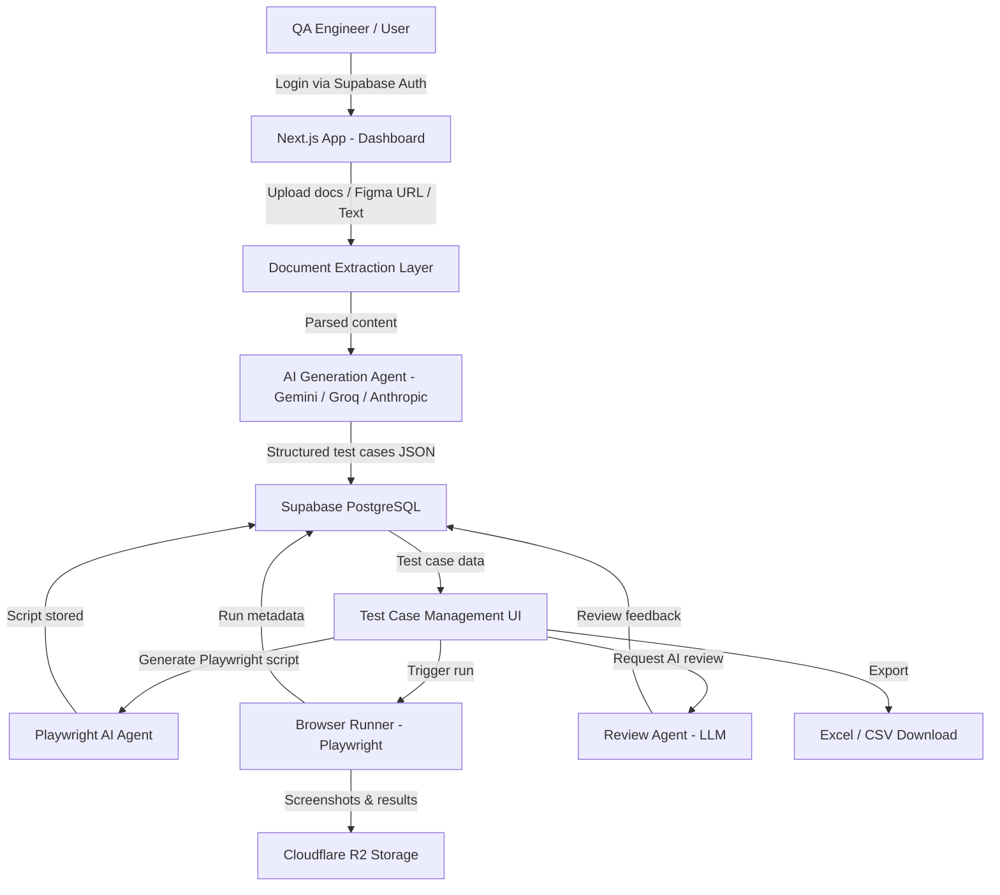

Built by **Jordan Le** (Le Van Anh Tan)
# QA-AI-Tool — System Documentation & Architecture Overview

<project_context>
**Project Name:** QA-AI-Tool
**Repository Description:** An AI-powered QA test case management platform that generates, reviews, and automates test cases using multiple LLM providers and Playwright browser automation.
**Target Audience:** Software Engineers, QA Engineers, Product Managers, and AI Assistant Models (Claude/LLMs).
**Purpose:** This document provides a complete high-level and detailed technical overview of the project to enable fast onboarding, seamless AI-assisted development, and clear cross-functional alignment.
</project_context>

---

## 1. Executive Summary (For Non-Technical Stakeholders & Newcomers)
<executive_summary>

### 🎯 What Problem Does This Project Solve?

Writing and maintaining QA test cases is time-consuming, inconsistent, and difficult to scale across large projects. QA engineers spend hours manually authoring test steps, reviewing coverage gaps, and running repetitive browser tests. This platform automates the entire test case lifecycle — from AI-generated creation to automated Playwright execution — so QA teams can focus on judgment rather than grunt work.

### 💡 Core Functionality & Real-World Analogy

* **The Analogy:** Think of this system as a **smart QA factory floor** — requirements and documents go in one end, fully written test cases and automated browser scripts come out the other, with AI supervisors reviewing quality at every station.
* **What it does:** It takes **requirement documents, Figma designs, or plain text descriptions** → processes them through **multi-LLM AI agents** → delivers **structured test cases, Playwright automation scripts, AI review feedback, coverage reports, and traceability matrices**.

### 🔑 Key Benefits

- **Efficiency:** Generates complete test case suites from documents in seconds instead of hours of manual writing.
- **Reliability:** AI review agents catch missing edge cases and inconsistent step definitions before they reach production.
- **Scalability:** Batch automation runs Playwright scripts across hundreds of test cases in parallel with rate-limited queuing.
- **Traceability:** Built-in coverage and traceability matrix maps every requirement to its test cases automatically.
- **Team Collaboration:** Multi-project, multi-member workspaces with role-based access and comment threads on every test case.

</executive_summary>

---

## 2. End-to-End System Workflow
<system_workflow>

### 🔄 High-Level Data & Process Flow



### 📍 Step-by-Step Execution Journey

1. **Initiation:** The workflow starts when a QA engineer logs into the dashboard and creates or opens a **Project**. Inside the project they navigate to the **Generate** workspace.

2. **Document Ingestion:** The user uploads a PDF, Excel/DOCX spec, or provides a Figma URL. The `document-extraction-agent` in `lib/ai/prompts/` extracts structured requirement text via `lib/documents/text-extractors.ts` and `lib/documents/figma-client.ts`.

3. **AI Test Generation:** The extracted requirements are passed to the `generation-agent` (`lib/ai/prompts/generation-agent.ts`) which calls Google Gemini, Groq, or the configured provider (`lib/ai/provider.ts`). It returns a structured JSON payload validated against `lib/ai/prompts/generation-response-schema.ts` containing test case titles, steps, preconditions, test data, and expected results.

4. **Persistence:** Generated test cases are written to Supabase PostgreSQL via the `/api/ai/generate` route and associated with the project. Versioning is handled automatically (`app/api/test-cases/[id]/versions/route.ts`).

5. **Review & Editing:** QA engineers refine test cases through the form editor (`components/test-case-form/`), request AI review feedback via `app/api/ai-reviews/route.ts` (powered by `lib/ai/prompts/review-agent.ts`), and collaborate through comment threads (`app/api/test-cases/[id]/comments/route.ts`).

6. **Automation:** For each test case, the engineer can generate a Playwright script via `/api/ai/playwright` (using `lib/ai/prompts/playwright-agent.ts`). Scripts are stored in Supabase. Running them triggers `lib/automation/browser-runner.ts`, which executes Playwright headlessly, captures screenshots, and stores them in Cloudflare R2 (`lib/automation/r2-storage.ts`).

7. **Batch Automation:** Multiple test cases can be queued via `app/api/automation/batch-run` with sequential processing via `process-next` polling and rate limiting (`lib/automation/rate-limit.ts`).

8. **Final Delivery:** Results, screenshots, and run metadata are surfaced in the Test Case detail panel and the Batch Progress Panel. Test cases can be exported to Excel (`lib/utils/test-case-excel.ts`) and reviewed in the Traceability Matrix.

</system_workflow>

---

## 3. Technical Architecture & Tech Stack (For Domain Experts & AI)
<technical_architecture>

### 🛠️ Technology Stack & Core Dependencies

| Category | Technology / Framework | Purpose |
| :--- | :--- | :--- |
| **Language / Runtime** | `TypeScript / Node.js 18+` | Core language for all frontend and backend code |
| **Framework** | `Next.js 14+ (App Router)` | Full-stack React framework — pages, layouts, and API routes |
| **UI** | `React 18 + Tailwind CSS` | Component rendering and utility-first styling |
| **Database** | `Supabase (PostgreSQL + Auth + RLS)` | Relational data persistence, authentication, and row-level security |
| **File Storage** | `Cloudflare R2` | Screenshot and file artifact storage (S3-compatible) |
| **AI — Primary** | `Google Gemini` | Test case generation, document extraction, Playwright script generation |
| **AI — Secondary** | `Groq` | Fast LLM inference for generation and enhancement tasks |
| **AI — Tertiary** | `Anthropic Claude` | Review, enhancement, and embedding tasks |
| **Browser Automation** | `Playwright` | Headless browser execution of generated test scripts |
| **Testing** | `Vitest` | Unit tests for lib utilities and automation helpers |
| **Deployment** | `Vercel` | Serverless deployment with edge functions |
| **i18n** | `Custom i18n Context` | English and Vietnamese localisation |
| **Document Parsing** | `Custom extractors (xlsx, pdf, docx)` | Requirement ingestion from uploaded files |

### 🏗️ Module Decomposition

- **`app/(auth)/`**: Handles user login and registration via Supabase Auth (email/password). Pages: `login`, `register`.

- **`app/(dashboard)/`**: Protected dashboard routes gated by Supabase session. Contains sub-routes for `dashboard`, `projects`, `tools`, and the core project workspace.

- **`app/api/`**: All Next.js Route Handlers (server-side API endpoints), organized into:
  - `ai/` — generation, enhancement, Playwright script creation, document parsing, embeddings
  - `automation/` — single run, batch run with `process-next` queue, inspection, screenshot retrieval
  - `test-cases/` — full CRUD, versioning, comments, automation scripts/runs, bulk operations, export
  - `projects/` — project CRUD, member management, environment management
  - `ai-reviews/` — AI-powered review of a test case's content
  - `test-case-sets/` — grouping test cases into logical sets

- **`components/test-case/`**: Test case detail view — tabs for steps, history, comments, AI review, Playwright automation (code viewer, run results, element preview, history list).

- **`components/test-case-form/`**: Controlled form for creating/editing test cases — steps editor, preconditions editor, test data editor with rich structured inputs.

- **`components/test-case-list/`**: Paginated, filterable table of test cases with bulk-select, bulk-delete bar, and create modal.

- **`components/test-case/generate-workspace/`**: Multi-panel generation wizard — document reader, wizard panel, generating modal, results panel, review panel, traceability matrix, test case cards.

- **`components/automation/`**: Batch automation UI — `RunAutomationModal`, `BatchProgressPanel`, `use-batch-automation` hook, `use-environments` hook.

- **`components/team/`**: Team management UI — member list, member row, invite form, team stats.

- **`components/tools/tool-runner/`**: Developer utility tools — UUID, Base64, Hash Generator, Timestamp, JSON Formatter, Regex Tester, Lorem Ipsum, NRIC, Fake File Generator.

- **`lib/ai/`**: AI provider abstraction layer:
  - `provider.ts` — selects active AI provider
  - `gemini.ts`, `groq.ts` — provider clients
  - `vision.ts` — vision/image analysis
  - `parse.ts` — response parsing helpers
  - `prompts/` — all agent prompt definitions and response schemas

- **`lib/automation/`**: Core automation engine:
  - `browser-runner.ts` — Playwright execution logic
  - `batch-runner.ts` — sequential batch queue manager
  - `rate-limit.ts` — request throttling (prevents API overload)
  - `r2-storage.ts` — Cloudflare R2 screenshot upload/download
  - `screenshot-storage.ts` — screenshot persistence facade

- **`lib/documents/`**: Document ingestion layer:
  - `text-extractors.ts` — extracts text from PDF, DOCX, XLSX, CSV uploads
  - `figma-client.ts` — fetches and parses Figma designs via the Figma REST API
  - `coverage.ts` — computes requirement-to-test-case coverage metrics

- **`lib/supabase/`**: Database client factory — `client.ts` (browser), `server.ts` (server-side RSC/Route Handler), `admin.ts` (service-role bypass for admin operations).

- **`lib/utils/`**: Shared utilities — Excel export (`test-case-excel.ts`), smart XLSX parsing (`smart-xlsx-parser.ts`), file download helpers, base64 conversion, NRIC generation, fake file payloads, lorem ipsum.

- **`lib/validators/`**: Zod or custom validators for test cases (`test-case.ts`), Playwright scripts (`playwright.ts`), and document uploads (`document.ts`).

- **`lib/test-case-similarity.ts`**: Detects duplicate or near-duplicate test cases using embedding-based comparison.

- **`lib/test-case-diff.ts`**: Computes structured diffs between test case versions for the version history viewer.

- **`lib/i18n/`**: Locale loading, context provider, and dictionaries for `en` and `vi`.

- **`__tests__/`**: Vitest unit tests for R2 storage, screenshot storage, rate limiting, and Playwright validators.

</technical_architecture>

---

## 4. Repository Directory Structure
<directory_structure>

```text
/
├── app/                          # Next.js App Router
│   ├── (auth)/                   # Public auth routes
│   │   ├── login/page.tsx
│   │   └── register/page.tsx
│   ├── (dashboard)/              # Protected dashboard routes
│   │   ├── layout.tsx            # Dashboard shell with nav
│   │   ├── dashboard/page.tsx    # Main dashboard overview
│   │   ├── tools/                # Developer utility tools
│   │   │   ├── page.tsx          # Tools grid index
│   │   │   └── [toolSlug]/page.tsx
│   │   └── projects/             # Multi-project workspace
│   │       ├── page.tsx          # Project list
│   │       └── [projectId]/
│   │           ├── page.tsx      # Project overview
│   │           ├── test-cases/   # Test case list + detail
│   │           ├── generate/     # AI generation workspace
│   │           ├── team/         # Team management
│   │           └── automation/environments/
│   ├── api/                      # Server-side Route Handlers
│   │   ├── ai/                   # AI endpoints (generate, enhance, playwright, embed, documents/parse)
│   │   ├── ai-reviews/           # AI review endpoint
│   │   ├── automation/           # Run, batch-run, inspect, screenshot
│   │   ├── projects/             # Project CRUD + members + environments
│   │   ├── test-cases/           # Test case CRUD + versions + comments + automation + export + bulk
│   │   └── test-case-sets/       # Test case set management
│   ├── globals.css               # Global Tailwind styles
│   ├── layout.tsx                # Root layout (fonts, providers)
│   └── page.tsx                  # Root redirect to dashboard
│
├── components/                   # React UI components
│   ├── auth/                     # SignOutButton
│   ├── automation/               # Batch automation UI (modal, progress panel, hooks)
│   ├── layout/                   # NavLink, LanguageToggle
│   ├── team/                     # MemberList, InviteForm, TeamStats
│   ├── test-case/                # Detail view panels (automation, comments, version history)
│   │   ├── automation/           # Code viewer, run result, element preview, history
│   │   └── generate-workspace/   # Generation wizard panels, traceability, test case card
│   ├── test-case-form/           # Steps, preconditions, test data editors + shared types
│   ├── test-case-list/           # Table, pagination, bulk-delete, create modal
│   └── tools/tool-runner/        # UUID, Base64, Hash, Timestamp, JSON, Regex, Lorem, NRIC tools
│
├── lib/                          # Core business logic and integrations
│   ├── ai/                       # LLM provider clients + prompt agents + schemas
│   │   └── prompts/              # generation-agent, review-agent, playwright-agent, enhance-agent, etc.
│   ├── api/client.ts             # Typed fetch wrapper for internal API calls
│   ├── automation/               # Browser runner, batch runner, rate limiter, R2/screenshot storage
│   ├── documents/                # Text extractors, Figma client, coverage calculator
│   ├── i18n/                     # Locale config, context, en/vi dictionaries
│   ├── supabase/                 # client.ts, server.ts, admin.ts
│   ├── utils/                    # Excel export, file helpers, NRIC, fake files, lorem ipsum
│   ├── validators/               # test-case, playwright, document validators
│   ├── test-case-diff.ts         # Version diff computation
│   └── test-case-similarity.ts   # Embedding-based duplicate detection
│
├── __tests__/                    # Vitest unit tests
│   ├── lib/r2-storage.test.ts
│   ├── lib/screenshot-storage.test.ts
│   ├── lib/rate-limit.test.ts
│   └── lib/playwright-validators.test.ts
│
├── schema.sql                    # Supabase PostgreSQL schema definitions
├── proxy.ts                      # Dev proxy configuration
├── vercel.json                   # Vercel deployment configuration
├── next.config.ts                # Next.js configuration
├── tailwind.config.ts            # Tailwind CSS configuration
├── tsconfig.json                 # TypeScript configuration
├── vitest.config.ts              # Vitest test runner configuration
├── eslint.config.mjs             # ESLint rules
├── postcss.config.js             # PostCSS (Tailwind processing)
├── package.json                  # NPM dependencies and scripts
├── CLOUDFLARE_R2_SETUP.md        # Guide for configuring Cloudflare R2 storage
├── IMPLEMENTATION_PLAN.md        # Development implementation notes
├── PROJECT_STRUCTURE.md          # Extended structure reference
└── README.md                     # This file
```

</directory_structure>

---

## 5. Getting Started & Execution Guide
<setup_instructions>

### 📋 Prerequisites

- `Node.js >= 18.x` and `npm` or `pnpm`
- `Git`
- A **Supabase** project (free tier works) — for database and auth
- A **Cloudflare R2** bucket — for screenshot/file storage (see `CLOUDFLARE_R2_SETUP.md`)
- At least one **AI provider** API key: Google Gemini, Groq, or Anthropic

### 🚀 Quick Start Commands

1. **Clone the Repository:**
   ```bash
   git clone https://github.com/AnhTan1420/QA-AI-Tool.git
   cd QA-AI-Tool
   ```

2. **Install Dependencies:**
   ```bash
   npm install
   ```

3. **Environment Configuration:**
   ```bash
   cp .env.example .env.local
   # Fill in the following required variables:
   ```

   | Variable | Description |
   | :--- | :--- |
   | `NEXT_PUBLIC_SUPABASE_URL` | Your Supabase project URL |
   | `NEXT_PUBLIC_SUPABASE_ANON_KEY` | Supabase anon/public key |
   | `SUPABASE_SERVICE_ROLE_KEY` | Supabase service role key (server-side admin) |
   | `GEMINI_API_KEY` | Google Gemini API key |
   | `GROQ_API_KEY` | Groq API key |
   | `ANTHROPIC_API_KEY` | Anthropic Claude API key |
   | `R2_ACCOUNT_ID` | Cloudflare account ID |
   | `R2_ACCESS_KEY_ID` | Cloudflare R2 access key |
   | `R2_SECRET_ACCESS_KEY` | Cloudflare R2 secret key |
   | `R2_BUCKET_NAME` | Cloudflare R2 bucket name |
   | `R2_PUBLIC_URL` | Public URL for R2 bucket |
   | `FIGMA_ACCESS_TOKEN` | Figma personal access token (optional) |

4. **Set Up the Database:**
   - In your Supabase dashboard, open the SQL editor.
   - Run the full contents of `schema.sql` to create all tables, RLS policies, and indexes.

5. **Run Locally:**
   ```bash
   npm run dev
   # App available at http://localhost:3000
   ```

6. **Run Test Suites:**
   ```bash
   npm test
   # Runs Vitest unit tests under __tests__/
   ```

7. **Build for Production:**
   ```bash
   npm run build
   npm start
   ```

### 🤖 Cloudflare R2 Configuration

Refer to `CLOUDFLARE_R2_SETUP.md` for step-by-step instructions on creating the R2 bucket, setting CORS, generating access credentials, and linking the public URL.

</setup_instructions>

---

## 6. Key API Reference
<api_reference>

### AI Endpoints (`/api/ai/`)

| Method | Route | Description |
| :--- | :--- | :--- |
| `POST` | `/api/ai/generate` | Generate test cases from text/document input using the generation agent |
| `POST` | `/api/ai/enhance` | Enhance an existing test case using the enhance agent |
| `POST` | `/api/ai/playwright` | Generate a Playwright automation script for a test case |
| `POST` | `/api/ai/embed` | Generate embeddings for similarity comparison |
| `POST` | `/api/ai/documents/parse` | Parse and extract structured text from uploaded documents |

### Test Case Endpoints (`/api/test-cases/`)

| Method | Route | Description |
| :--- | :--- | :--- |
| `GET/POST` | `/api/test-cases` | List all test cases / Create a new test case |
| `GET/PUT/DELETE` | `/api/test-cases/[id]` | Read, update, or delete a specific test case |
| `GET` | `/api/test-cases/[id]/versions` | Retrieve full version history for a test case |
| `GET/POST` | `/api/test-cases/[id]/comments` | List or add comments on a test case |
| `GET/POST` | `/api/test-cases/[id]/automation/scripts` | List or create Playwright scripts for a test case |
| `GET/PUT/DELETE` | `/api/test-cases/[id]/automation/scripts/[scriptId]` | Manage a specific script |
| `GET` | `/api/test-cases/[id]/automation/runs` | List execution runs for a test case |
| `GET` | `/api/test-cases/export` | Export test cases to Excel |
| `POST` | `/api/test-cases/bulk` | Bulk create or delete test cases |

### Automation Endpoints (`/api/automation/`)

| Method | Route | Description |
| :--- | :--- | :--- |
| `POST` | `/api/automation/run` | Execute a single Playwright script run |
| `POST` | `/api/automation/batch-run` | Start a batch automation job |
| `POST` | `/api/automation/batch-run/[id]/process-next` | Advance the batch queue to the next test case |
| `GET` | `/api/automation/inspect` | Inspect browser DOM elements at a URL |
| `GET` | `/api/automation/runs/[runId]/screenshot` | Retrieve screenshot from R2 for a run |

### Project & Team Endpoints

| Method | Route | Description |
| :--- | :--- | :--- |
| `GET/POST` | `/api/projects` | List or create projects |
| `GET/PUT/DELETE` | `/api/projects/[projectId]` | Manage a specific project |
| `GET/POST` | `/api/projects/[projectId]/members` | List or invite team members |
| `GET/POST` | `/api/projects/[projectId]/environments` | List or create automation environments |
| `POST` | `/api/ai-reviews` | Request an AI review of a test case |

</api_reference>

---

## 7. Database Schema Overview
<database_schema>

The Supabase PostgreSQL schema (defined in `schema.sql`) contains the following primary tables:

- **`profiles`** — User profile data linked to Supabase Auth `auth.users`.
- **`projects`** — Top-level containers for test case work. Each project belongs to a creator with optional team membership.
- **`project_members`** — Junction table for project membership with role-based access.
- **`test_case_sets`** — Logical groupings of test cases within a project (e.g., "Regression Suite", "Smoke Tests").
- **`test_cases`** — Core entity. Stores title, description, steps (JSONB), preconditions, test data, expected results, priority, status, and metadata.
- **`test_case_versions`** — Append-only version snapshots of test cases for full history tracking.
- **`test_case_comments`** — Threaded comments on individual test cases.
- **`automation_scripts`** — Playwright scripts associated with a test case (code, language, status).
- **`automation_runs`** — Execution records for automation runs — status, logs, screenshot URL, duration.
- **`automation_environments`** — Named environments (e.g., Staging, Production) with base URLs and auth configs per project.
- **`batch_runs`** — Batch job metadata: which test cases to run, current progress, status.

All tables implement Supabase **Row Level Security (RLS)** policies to ensure users can only access data within their authorized projects.

</database_schema>

---

## 8. Guidelines for AI Assistants (Claude / GPT Context)
<ai_guidelines>

When analyzing, generating code, or modifying files in this repository, follow these rules:

1. **Framework Conventions:** This is a **Next.js App Router** project. All pages are React Server Components by default. Use `"use client"` only for components that require interactivity, browser APIs, or React hooks. API endpoints are Route Handlers (`route.ts`), not the Pages Router's `pages/api/`.

2. **Database Access Pattern:** Always use the appropriate Supabase client for the context:
   - Server Components / Route Handlers → `lib/supabase/server.ts` (cookie-based session)
   - Client Components → `lib/supabase/client.ts`
   - Admin operations (RLS bypass) → `lib/supabase/admin.ts` (service role, server-only)

3. **AI Provider Abstraction:** Never call Gemini, Groq, or Anthropic SDKs directly from route handlers. Route all LLM calls through `lib/ai/provider.ts` and the prompt modules in `lib/ai/prompts/`. Validate responses against the corresponding response schema (e.g., `generation-response-schema.ts`, `playwright-response-schema.ts`).

4. **Automation Safety:** `lib/automation/browser-runner.ts` runs Playwright in a server environment. Always validate Playwright scripts via `lib/validators/playwright.ts` before execution. Respect the rate limiter (`lib/automation/rate-limit.ts`) for batch jobs.

5. **Architectural Consistency:** Business logic belongs in `lib/`. Components in `components/` must only contain UI logic and call into `lib/` or API routes via `lib/api/client.ts`. Do not embed SQL, LLM calls, or file I/O directly inside React components.

6. **Type Safety:** All new code must be fully typed TypeScript. Shared types between components and API routes belong in the nearest `types.ts` file within the relevant module folder (e.g., `components/test-case-list/types.ts`, `components/test-case-form/types.ts`).

7. **i18n:** All user-facing strings must be added to both `lib/i18n/dictionaries/en.ts` and `lib/i18n/dictionaries/vi.ts`. Use the `useLanguage()` context hook (from `lib/i18n/language-context.tsx`) to access translated strings in client components.

8. **Testing:** New utility functions in `lib/` should have corresponding unit tests in `__tests__/lib/`. Use Vitest. Mock Supabase and external API calls — do not make real network requests in tests.

9. **Storage:** All file uploads and screenshots go through `lib/automation/r2-storage.ts`. Do not use local filesystem storage — the deployment target is Vercel serverless, which has no persistent disk.

10. **Documentation Sync:** When adding new API routes, update section 6 (Key API Reference) of this document. When adding new modules, update sections 3 and 4.

</ai_guidelines>

## License

MIT License — see [LICENSE](LICENSE) for details.

---

Built by **Jordan Le** (Le Van Anh Tan)